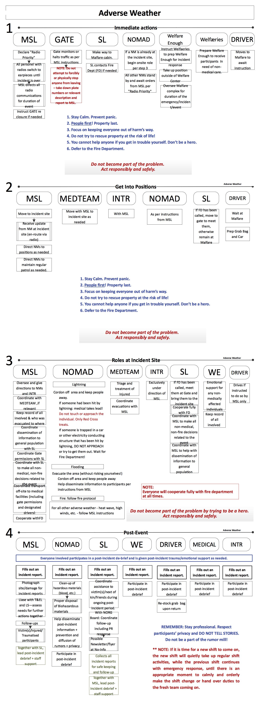

_Emergency Response Protocol:_

**Adverse Weather**

_ **Bad storms, flooding, lightning strikes, high winds, wild fires, heat waves, etc.** _

- Stay calm, help prevent panic.
- Focus is on keeping everyone out of harm's way and minimising damage.
- People first. Property last!
- Safety first!
- Remember: do not become a part of the problem. Follow directions, stay safe.
- Full cooperation with the fire department – they are in charge once they get on site.
- In case of lightning strikes or fire caused by lightning – defer to Fire Department. Do not try to free persons trapped by lightning. Set up a perimeter and wait for the Fire Department.
- In case of flooding – set up perimeter, keep people away. Do not try to rescue property at the risk of life.
- In case of high winds, tornadoes –Do not try to rescue property at the risk of life. Keep thrill-seekers/cameras/videos away!
- In case of death due to adverse weather - follow protocols for 'Death on Site'
- Privacy of all individuals involved in the incident is to be respected at all times, and the spread of rumours should be contained – all team members to actively assist in this!

­­­
