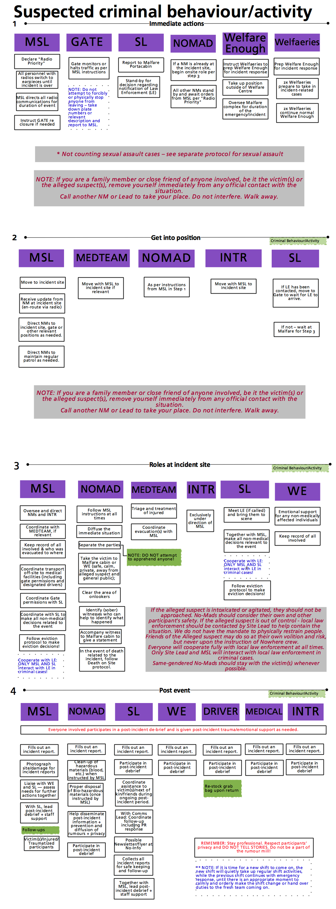

_Emergency Response Protocol:_

**Criminal Behaviour / Activity (non sexual)**

**Criminal behaviour/activity includes:** theft, physical assault, abuse (of a child or adult), threatening, dangerous or harmful acts towards another person or people. (_sexual assault and rape are covered in a separate protocol)_.

**In the event of a crime, the first responsibility is to the victim(s). The organisation does not have a security team, training or (legal) mandate to deal with the person/people suspected of committing a crime.**

- If you are a family member or close friend of anyone involved, be it the victim(s) or the alleged suspect(s), removeyourselfimmediately from any official contact with the situation. Call another NoMad or Lead to replace you right away and walk away.
- Law enforcement should be notified after consultation with those involved, and if it is warranted or wanted. Notifying law enforcement is mandatory in cases of suspected child abuse.
- The victim(s) should be moved to a safe, private environment (Malfare cabin, Tea&Empathy) where their needs can be take care of and supported.
- The victim(s), once safe, should be examined by a Red Cross medic and any injuries should be documented (photographed and notes taken) and treated.
- The victim(s) should then be asked for any relevant information to be used to resolve the situation and/or to be passed onto law enforcement once they arrive on site if relevant.
- An attempt to locate the accused/alleged suspect(s) should be made, but Nowhere staff should never attempt to apprehend or detain anyone.
- If the alleged suspect(s) is/are cooperative and the victim(s) so desire, mediation can be undertaken.
- If eviction is warranted, the eviction protocol should be followed.
- When law enforcement arrives, the alleged suspect(s) should be pointed out to them by SL.
- Law enforcement should be cooperated with fully by everyone. SL and MSL manage contact with law enforcement.
- Privacy of all parties (victims and alleged suspects) is to be respected at all times, and the spread of rumours should be contained – all team members to actively assist in this!
- No sensitive information to be given via radios.

­­­
