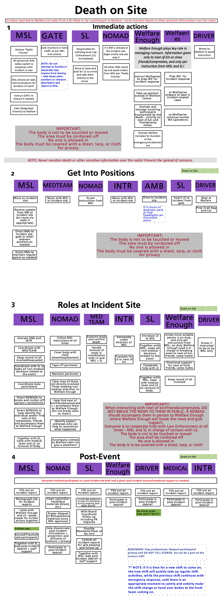

_Emergency Response Protocol:_

**Death on Site**

- In the event of a death on site the area should be immediately cordoned off and nobody allowed to disturbed the scene, the body should not be moved but should be covered with a sheet, blanket or tarp.

- Police are to be immediately notified.

- If the identity of the individual can be established, an attempt must be made to locate any next of kin if they are at the event or anybody who may have been friends or campmates of the individual to inform them.
  - This should not be done in public. 
  - Individuals should be asked to accompany you to Welfare Enough for an urgent matter. Welfare Enough (or best other suitable on-duty individual) will break the news and provide support.

- Next of kin and close friends/campmates should remain at Welfare Enough for the duration of the incident to allow for smooth resolution and proper treatment of the incident site

- If there is suspicion of foul play or murder, next of kin and friends/campmates should be kept away from any suspect(s). No contact should be allowed between suspects and next of kin/friends/campmates.

- One of the Site Leads shall be responsible for:
  - ensuring follow-up care happens, and
  - contacting off-site next of kin/emergency contact(s).

- The person's tent/campsite/vehicle should be located if possible and also cordoned off and prevented from being disturbed: even if it is shared.

- If there is suspicion of foul play or murder – no attempt to apprehend, restrain or otherwise physically engage with the alleged suspect(s) should be made! We are not police or security. Monitor without endangering self and point suspect out to police when they arrive.
   - If in the view of the site leads and Malfare shift lead suspects may disappear, consider using security, in line with the [007 protocol](../007/).

- When police arrive they should be shown to the scene and co-operated with fully.

- The spread of rumours should be contained – all team members to actively assist in this!

- No sensitive information to be given via radios.

­­­
