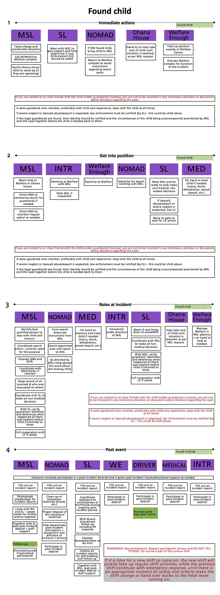

# Found Child &mdash; Unaccompanied Minor

**Definition: The event of a minor (anyone under the age of 18) found
lost (unable to find his/her way or find his/her guardian(s)), in
distress or in any way at risk and unaccompanied by a legal
guardian.**

In the event of a found/unaccompanied child, the gate does not need to
be shut but the following should be done:

- The child is brought to Malfare/Ohana House and kept there until the
    parents are located;

- A same-gendered crew member, preferably with child-care experience,
    stays with the child at all times;

- Names, ages, description and last known location of the legal
    guardian(s) should be taken from the child in a gentle manner,
    then a search party sent;

- If the legal guardian(s) are found, their identity should be
    verified and the circumstances of the child being unaccompanied
    ascertained by MSL and Site Lead together before the child is
    handed back to them;

- If severe neglect or (sexual) abuse/assault is suspected, law
    enforcement must be notified &ndash; this could be child abuse;

- In case of death due to a found/unaccompanied child incident
    &ndash; follow protocols for 'Death on Site';

- If eviction is warranted in relation to a found/unaccompanied child
    incident &ndash; follow the 'Eviction Protocol';

- Privacy of all individuals involved in the incident is to be
    respected at all times, and the spread of rumours should be
    contained &ndash; all team members to actively assist in this.

If you are related to, or close friends with, the child and/or
guardians involved &mdash; remove yourself from any involvement in
decisions, or discussions about decisions, or interviews with the
guardians, regarding the case, including but not limited to the
involvement of law enforcement, decisions regarding neglect, eviction,
etc.

­­­
