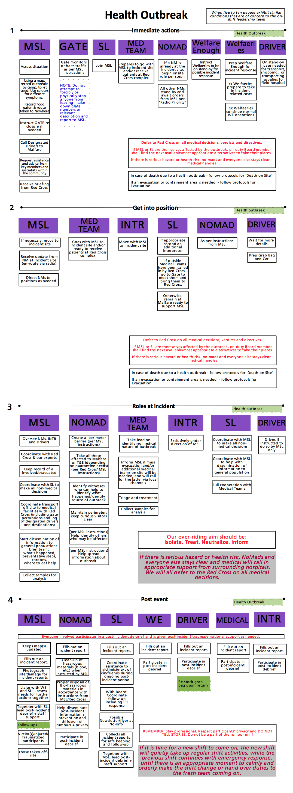

# Health Outbreak

In a temporary community, where people are together, the effective treatment of health incidents is vital: to prevent spread, and to make experiences better for everyone.

This protocol should be involved when more than ten people are suffering from similar symptoms and circumstances: including, but by no means limited to any health related outbreak &mdash; flu, food poisoning, stomach problems, swarm of insects, etc.

- Our main aim is: Treat/Neutralize. Isolate/Contain. Inform;
  - Treat those needing treatment (on-site or off-site). Aim to identify and neutralize cause: treat symptoms.
  - Contain the spread! Isolate sick people (with same symptoms) unless otherwise advised.  Move people to the sick-bay. Limit lavatories used by sick people. Do not share bottles, cutlery, crockery etc. Thoroughly wash-up. Wear protective equipment if needed.
  - Inform everyone on what's going on; what they need to do to stay healthy / recover.
- Focus on provision of information and containment.
- Defer to Red Cross on all medical decisions, verdicts and
    directives.
- If Malfare Shift Lead or Site Leads are themselves affected by the
    outbreak, next available sober Leads should be found to take their
    places.
- If there is serious hazard or health risk, everyone stays clear. Medical will call in appropriate support from surrounding hospitals.
- In case of death due to a health outbreak &ndash; follow protocols for 'Death on Site'.
- Privacy of all individuals involved incidents is to be respected at all times, and the spread of rumours should be contained &mdash; all team members to actively assist in this.

 
­­­
