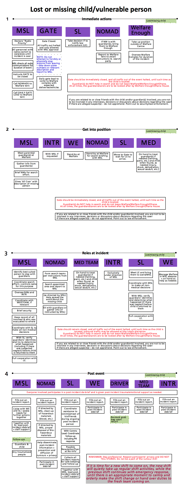

_Emergency Response Protocol:_

**Missing Child**

_ **Definition: The event of a minor (anyone under the age of 18) reported missing, and their whereabouts are not known.** _

- Gate should be immediately closed, and all traffic out of the event halted, until such time as the child is located.
- Law enforcement must be called immediately (by SL).
- A Search and Rescue team should be assembled (by MSL).
- If severe neglect or (sexual) abuse/assaultis suspected at any point during the incident response, law enforcement must be informed – this is child abuse (SL).
- The Legal Guardians should be brought to Malfare/T&E and kept there until the child is found. The guardian(s) do NOT help in search and do not leave Malfare/T&E.
- Member of crew (designated by MSL) stays with LGs at all times!
- Name, nicknames, age, description and last known location of the child should be broadcast on the radio to the search and rescue team, who will proceed with a grid search until the child is found.

- Once child is found, identity of legal guardian(s) should be verified and the circumstances of the child having gone missing be ascertained by MSL and Site Lead together before the child is handed back to them.
- If there is a suspect – do not apprehend. Point out to law enforcement. Keep away from legal guardian(s).
- In case of death due to a missing child incident - follow protocols for 'Death on Site'
- If eviction is warranted in relation to a lost child incident – follow the 'Eviction Protocol'
- Privacy of all individuals involved in the incident is to be respected at all times, and the spread of rumours should be contained – all team members to actively assist in this!
- If you are related to, or close friends with, the child and/or guardians involved – remove yourself from any involvement in decisions, or discussions about decisions, or interviews with the guardians, regarding the case, including but not limited to the involvement of law enforcement, decisions regarding neglect, eviction, etc.
- 

­­­
