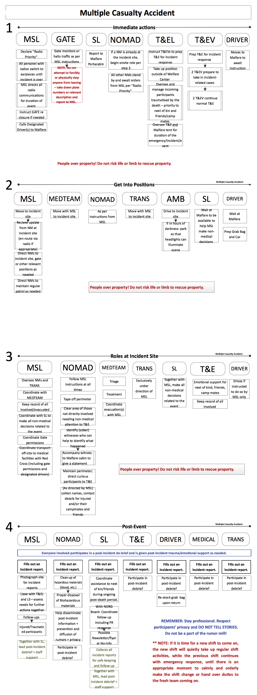
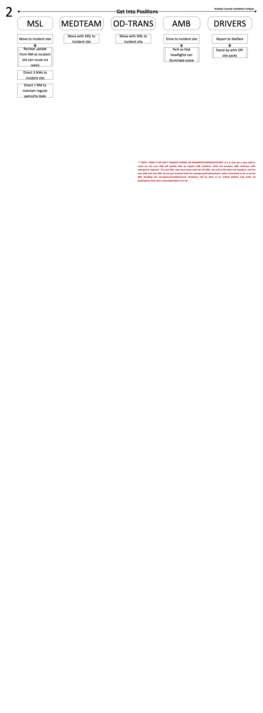

_Emergency Response Protocol:_

**Multi-Casualty Incident**

_ **Any incident, accident or event resulting in the physical injury to varying degrees of multiple participants.** _

- Focus on assisting the injured, triage, evacuation, managing the accident site and emotional support to secondary traumas.

- The accident/incident site should be cordoned off and no one but medical and Malfare crew let in. Do not disturb the accident site. Leave it as it is. Photos will need to be taken later as part of the incident reports.
- People over property! Do not risk life or limb to rescue property.
- If there is fire involved, follow 'Fire Emergency Protocol'. Note: notify the Fire Department immediately – it takes them time to get to us!
- Red Cross leads triage and treatment of injured.
- In case of death – follow 'Death on Site Protocol'.
- Full cooperation with Red Cross and any other rescue or emergency services call on site.
- If eviction of a participant is warranted in connection to an accident on site, the 'Eviction Protocol' should be followed.
- Privacy of all individuals involved in the incident is to be respected at all times, and the spread of rumours should be contained – all team members to actively assist in this!

­­­
