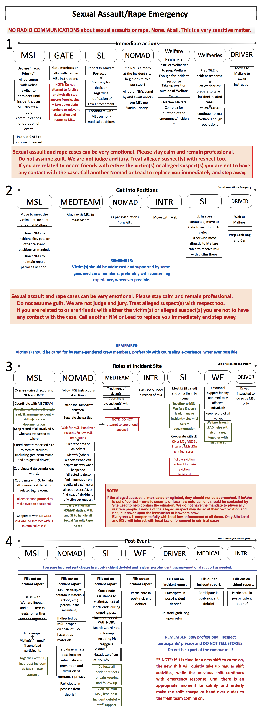

_Emergency Response Protocol:_

**Sexual Assault / Rape**

**Definition:** A participant is forced into sexual or indecent acts in which no consent is given, potentially accompanied by actual or threatened (physical) force that induce fear, shame, or mental suffering.

_NOTE: NO RADIO COMMUNICATIONS about sexual assaults or rape. None. At all. This is a very sensitive matter._

- In cases of sexual assault the victim's care is paramount. They will be vulnerable, distraught, scared and embarrassed. The moment the sexual assault is reported they need to be brought somewhere private and safe where they can be cared for and law enforcement and medical can treat them.
- Only MSL and/or SL, and/or no more than one Nomad or T&E volunteer specifically designated by MSL, depending on genders and qualifications, should be in the cabin with the victim. 
- In addition, the victim should be asked if there is anybody at the event that they would like brought to them and that person should be found.
- Do not assume guilt! We are not judge nor jury. Treat the alleged suspect(s) with respect too. Leave legal matters and judgements to Law Enforcement!
- The alleged suspect(s) should be kept away from the victim. If the alleged suspect(s) is/are cooperative, they should be interviewed separately, out of earshot and view from the victim.
- The victim should be cared for by a member of the same gender, preferably someone who has had counselling experience.
- The victim should not be left alone, not even for a second.
- Law enforcement must be called in if the victim wants. If the victim is not conscious or unable to make such a decision, the matter is automatically considered a serious criminal offence and law enforcement must be called.
- As with Violent assault / Crime, no attempt to apprehend the alleged suspect(s) should be made and no one should put themselves in harm's way.
- Full cooperation with local law enforcement at all times.

- Privacy of all parties (victims and suspects) is to be respected at all times, and the spread of rumours should be contained – all team members to actively assist in this!
- No sensitive information to be given via radios.

­­­
